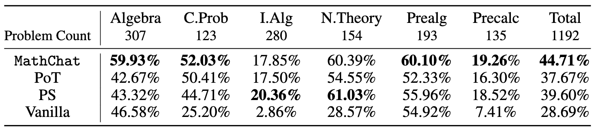

**TL;DR:**
* **We introduce MathChat, a conversational framework leveraging Large Language Models (LLMs), specifically GPT-4, to solve advanced mathematical problems.**
* **MathChat improves LLM's performance on challenging math problem-solving, outperforming basic prompting and other strategies by about 6%. The improvement was especially notable in the Algebra category, with a 15% increase in accuracy.**
* **Despite the advancement, GPT-4 still struggles to solve very challenging math problems, even with effective prompting strategies. Further improvements are needed, such as the development of more specific assistant models or integrating new tools and prompts.**

Employing Large Language Models (LLMs) to address mathematical problems is an intriguing research endeavor, considering the abundance of math problems expressed in natural language across numerous science and engineering fields. Existing ways of using LLMs to solve math problems are barely evaluated with recent chat-optimized LLMs, especially on more challenging math problems.

In this blog post, we introduce MathChat, a conversational framework designed for solving challenging math problems with LLMs. This framework takes advantage of the chat-optimized feature of state-of-the-art LLMs, where a user proxy agent and an LLM assistant work together to tackle math problems.

## The MathChat Framework

At the heart of MathChat is a conversation that starts with the user proxy agent. The proxy agent presents a math problem to the LLM assistant, framed by an initial prompt that guides the assistant in how it should work collaboratively to solve the problem. Notably, the assistant is directed to solve the problem in a specific way, leveraging existing effective prompting methods and tool-using techniques.

Effective prompting methods such as CoT (chain-of-thought) and tool-using are incorporated in the initial prompt. Key components of the prompt include:

- **Tool-using Prompt:** This guides the LLM assistant to use Python code in the correct format to address the problem, allowing the user proxy agent to parse the code and provide the appropriate results.

- **Problem-Solving Strategy Selection Prompt:** The assistant is instructed to choose one of three potential problem-solving strategies, including:
  1. Writing a Python program to solve the problem directly.
  2. Solving the problem directly without using Python, which exercises LLMs' inherent reasoning capabilities.
  3. Solving the problem step by step with Python. This should be used when the first two strategies aren't suitable.

- **Final Answer Encapsulation Prompt:** This part instructs the assistant to put the final answer in *\boxed*{}.

The prompt design in MathChat is flexible and can easily be refined to include other tools, such as Wolfram Alpha. Below is an example of using MathChat to solve problem:

## Experiment Setup

For this experiment, we focus on the level-5 problems from the MATH dataset, which are composed of high school competition problems. These problems include the application of theorems and complex equation derivation and are challenging even for undergraduate students. We evaluate on 6 of 7 categories from the dataset (excluding Geometry): Prealgebra, Algebra, Number Theory, Counting and Probability, Intermediate Algebra, and Precalculus.

We evluate on GPT-4 and use the default configuration of the OpenAI API. MathChat is allowed a maximum of 15 message exchanges. To access the final performance, we manually compare the final answer with the correct answer.  For the vanilla prompt, Program Synthesis, and MathChat, we have GPT-4 enclose the final answer in *\boxed*{}, and we take the return of the function in PoT as the final answer.

We also evaluate the following methods for comparison:

1. **Vanilla prompting:** Evaluates GPT-4's direct problem-solving capability. The prompt used is: *""Solve the problem carefully. Put the final answer in \boxed{}"*.

2. **Program of Thoughts (PoT):** Uses a zero-shot PoT prompt which requests the model to create a *Solver* function to solve the problem and return the final answer.

3. **Program Synthesis (PS) prompting:** Like PoT, it prompts the model to write a program to solve the problem. The prompt used is: *"Write a program that answers the following question: \{Problem\}"*.

## Experiment Results

The accuracy on all the problems with difficulty level-5 from different categories of the MATH dataset with different methods is shown below:

We found that compared to basic prompting, which demonstrates the innate capabilities of GPT-4, utilizing Python within the context of PoT or PS strategy improved the overall accuracy by about 10%. This increase was mostly seen in categories involving more numerical manipulations, such as Counting & Probability and Number Theory, and in more complex categories like Intermediate Algebra and Precalculus.

For categories like Algebra and Prealgebra, PoT and PS showed little improvement, and in some instances, even led to a decrease in accuracy. However, MathChat was able to enhance total accuracy by around 6% compared to PoT and PS, showing competitive performance across all categories. Remarkably, MathChat improved accuracy in the Algebra category by about 15% over other methods. Note that categories like Intermediate Algebra and Precalculus remained challenging for all methods, with only about 20% of problems solved accurately.

The code for experiments can be found at this [repository](https://github.com/kevin666aa/FLAML/tree/gpt_math_solver/flaml/autogen/math).
We now provide an implementation of MathChat using the interactive agents in FLAML. See this [notebook](https://github.com/microsoft/FLAML/blob/main/notebook/autogen_agent_MathChat.ipynb) for example usage.

## Analysis and Discussion

We explored GPT-4's capabilities in complex math problem-solving with different prompt methods, including a newly proposed MathChat framework.

Despite MathChat's improvements over previous methods, the results show that complex math problem is still challenging for recent powerful LLMs, like GPT-4, even with help from external tools. Further work can be done to enhance this framework, for example, training an assistant model on top of the user proxy agent to give more specific instructions or to derive new prompts and incorporate new tools.

MathChat has the potential to be adapted into a copilot system, which could assist users with math problems. This system could allow users to be more involved in the problem-solving process, potentially enhancing learning.

## For Further Reading

* [Research paper of MathChat](https://arxiv.org/abs/2306.01337)
* [Documentation about `flaml.autogen`](/docs/Use-Cases/Auto-Generation)

*Do you have any experience to share about LLM applications? Do you like to see more support or research of LLM optimization or automation? Please join our [Discord](https://discord.gg/Cppx2vSPVP) server for discussion.*
