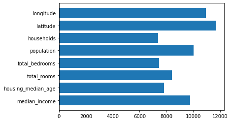
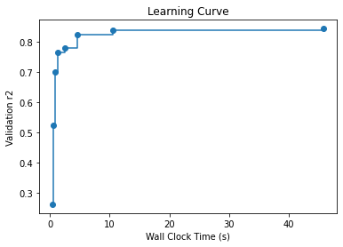

# AutoML for LightGBM

### Use built-in LGBMEstimator

```python
from flaml import AutoML
from flaml.data import load_openml_dataset

# Download [houses dataset](https://www.openml.org/d/537) from OpenML. The task is to predict median price of the house in the region based on demographic composition and a state of housing market in the region.
X_train, X_test, y_train, y_test = load_openml_dataset(dataset_id=537, data_dir='./')

automl = AutoML()
settings = {
    "time_budget": 60,  # total running time in seconds
    "metric": 'r2',  # primary metrics for regression can be chosen from: ['mae','mse','r2']
    "estimator_list": ['lgbm'],  # list of ML learners; we tune lightgbm in this example
    "task": 'regression',  # task type  
    "log_file_name": 'houses_experiment.log',  # flaml log file
    "seed": 7654321,    # random seed
}
automl.fit(X_train=X_train, y_train=y_train, **settings)
```

#### Sample output

```
[flaml.automl: 11-15 19:46:44] {1485} INFO - Data split method: uniform
[flaml.automl: 11-15 19:46:44] {1489} INFO - Evaluation method: cv
[flaml.automl: 11-15 19:46:44] {1540} INFO - Minimizing error metric: 1-r2
[flaml.automl: 11-15 19:46:44] {1577} INFO - List of ML learners in AutoML Run: ['lgbm']
[flaml.automl: 11-15 19:46:44] {1826} INFO - iteration 0, current learner lgbm
[flaml.automl: 11-15 19:46:44] {1944} INFO - Estimated sufficient time budget=3232s. Estimated necessary time budget=3s.
[flaml.automl: 11-15 19:46:44] {2029} INFO -  at 0.5s,	estimator lgbm's best error=0.7383,	best estimator lgbm's best error=0.7383
[flaml.automl: 11-15 19:46:44] {1826} INFO - iteration 1, current learner lgbm
[flaml.automl: 11-15 19:46:44] {2029} INFO -  at 0.6s,	estimator lgbm's best error=0.4774,	best estimator lgbm's best error=0.4774
[flaml.automl: 11-15 19:46:44] {1826} INFO - iteration 2, current learner lgbm
[flaml.automl: 11-15 19:46:44] {2029} INFO -  at 0.7s,	estimator lgbm's best error=0.4774,	best estimator lgbm's best error=0.4774
[flaml.automl: 11-15 19:46:44] {1826} INFO - iteration 3, current learner lgbm
[flaml.automl: 11-15 19:46:44] {2029} INFO -  at 0.9s,	estimator lgbm's best error=0.2985,	best estimator lgbm's best error=0.2985
[flaml.automl: 11-15 19:46:44] {1826} INFO - iteration 4, current learner lgbm
[flaml.automl: 11-15 19:46:45] {2029} INFO -  at 1.3s,	estimator lgbm's best error=0.2337,	best estimator lgbm's best error=0.2337
[flaml.automl: 11-15 19:46:45] {1826} INFO - iteration 5, current learner lgbm
[flaml.automl: 11-15 19:46:45] {2029} INFO -  at 1.4s,	estimator lgbm's best error=0.2337,	best estimator lgbm's best error=0.2337
[flaml.automl: 11-15 19:46:45] {1826} INFO - iteration 6, current learner lgbm
[flaml.automl: 11-15 19:46:46] {2029} INFO -  at 2.5s,	estimator lgbm's best error=0.2219,	best estimator lgbm's best error=0.2219
[flaml.automl: 11-15 19:46:46] {1826} INFO - iteration 7, current learner lgbm
[flaml.automl: 11-15 19:46:46] {2029} INFO -  at 2.9s,	estimator lgbm's best error=0.2219,	best estimator lgbm's best error=0.2219
[flaml.automl: 11-15 19:46:46] {1826} INFO - iteration 8, current learner lgbm
[flaml.automl: 11-15 19:46:48] {2029} INFO -  at 4.5s,	estimator lgbm's best error=0.1764,	best estimator lgbm's best error=0.1764
[flaml.automl: 11-15 19:46:48] {1826} INFO - iteration 9, current learner lgbm
[flaml.automl: 11-15 19:46:54] {2029} INFO -  at 10.5s,	estimator lgbm's best error=0.1630,	best estimator lgbm's best error=0.1630
[flaml.automl: 11-15 19:46:54] {1826} INFO - iteration 10, current learner lgbm
[flaml.automl: 11-15 19:46:56] {2029} INFO -  at 12.4s,	estimator lgbm's best error=0.1630,	best estimator lgbm's best error=0.1630
[flaml.automl: 11-15 19:46:56] {1826} INFO - iteration 11, current learner lgbm
[flaml.automl: 11-15 19:47:13] {2029} INFO -  at 29.0s,	estimator lgbm's best error=0.1630,	best estimator lgbm's best error=0.1630
[flaml.automl: 11-15 19:47:13] {1826} INFO - iteration 12, current learner lgbm
[flaml.automl: 11-15 19:47:15] {2029} INFO -  at 31.1s,	estimator lgbm's best error=0.1630,	best estimator lgbm's best error=0.1630
[flaml.automl: 11-15 19:47:15] {1826} INFO - iteration 13, current learner lgbm
[flaml.automl: 11-15 19:47:29] {2029} INFO -  at 45.8s,	estimator lgbm's best error=0.1564,	best estimator lgbm's best error=0.1564
[flaml.automl: 11-15 19:47:33] {2242} INFO - retrain lgbm for 3.2s
[flaml.automl: 11-15 19:47:33] {2247} INFO - retrained model: LGBMRegressor(colsample_bytree=0.8025848209352517,
              learning_rate=0.09100963138990374, max_bin=255,
              min_child_samples=42, n_estimators=363, num_leaves=216,
              reg_alpha=0.001113000336715291, reg_lambda=76.50614276906414,
              verbose=-1)
[flaml.automl: 11-15 19:47:33] {1608} INFO - fit succeeded
[flaml.automl: 11-15 19:47:33] {1610} INFO - Time taken to find the best model: 45.75616669654846
[flaml.automl: 11-15 19:47:33] {1624} WARNING - Time taken to find the best model is 76% of the provided time budget and not all estimators' hyperparameter search converged. Consider increasing the time budget.
```

#### Retrieve best config

```python
print('Best hyperparmeter config:', automl.best_config)
print('Best r2 on validation data: {0:.4g}'.format(1-automl.best_loss))
print('Training duration of best run: {0:.4g} s'.format(automl.best_config_train_time))
print(automl.model.estimator)
# Best hyperparmeter config: {'n_estimators': 363, 'num_leaves': 216, 'min_child_samples': 42, 'learning_rate': 0.09100963138990374, 'log_max_bin': 8, 'colsample_bytree': 0.8025848209352517, 'reg_alpha': 0.001113000336715291, 'reg_lambda': 76.50614276906414}
# Best r2 on validation data: 0.8436
# Training duration of best run: 3.229 s
# LGBMRegressor(colsample_bytree=0.8025848209352517,
#               learning_rate=0.09100963138990374, max_bin=255,
#               min_child_samples=42, n_estimators=363, num_leaves=216,
#               reg_alpha=0.001113000336715291, reg_lambda=76.50614276906414,
#               verbose=-1)
```

#### Plot feature importance

```python
import matplotlib.pyplot as plt
plt.barh(automl.model.estimator.feature_name_, automl.model.estimator.feature_importances_)
```


#### Compute predictions of testing dataset

```python
y_pred = automl.predict(X_test)
print('Predicted labels', y_pred)
# Predicted labels [143391.65036562 245535.13731811 153171.44071629 ... 184354.52735963
#  235510.49470445 282617.22858956]
```

#### Compute different metric values on testing dataset

```python
from flaml.ml import sklearn_metric_loss_score
print('r2', '=', 1 - sklearn_metric_loss_score('r2', y_pred, y_test))
print('mse', '=', sklearn_metric_loss_score('mse', y_pred, y_test))
print('mae', '=', sklearn_metric_loss_score('mae', y_pred, y_test))
# r2 = 0.8505434326526395
# mse = 1975592613.138005
# mae = 29471.536046068788
```

#### Compare with untuned LightGBM

```python
from lightgbm import LGBMRegressor

lgbm = LGBMRegressor()
lgbm.fit(X_train, y_train)
y_pred = lgbm.predict(X_test)
from flaml.ml import sklearn_metric_loss_score
print('default lgbm r2', '=', 1 - sklearn_metric_loss_score('r2', y_pred, y_test))
# default lgbm r2 = 0.8296179648694404
```

#### Plot learning curve

How does the model accuracy improve as we search for different hyperparameter configurations?

```python
from flaml.data import get_output_from_log
import numpy as np

time_history, best_valid_loss_history, valid_loss_history, config_history, metric_history = \
    get_output_from_log(filename=settings['log_file_name'], time_budget=60)
plt.title('Learning Curve')
plt.xlabel('Wall Clock Time (s)')
plt.ylabel('Validation r2')
plt.step(time_history, 1 - np.array(best_valid_loss_history), where='post')
plt.show()
```


### Use a customized LightGBM learner

The native API of LightGBM allows one to specify a custom objective function in the model constructor. You can easily enable it by adding a customized LightGBM learner in FLAML. In the following example, we show how to add such a customized LightGBM learner with a custom objective function.

#### Create a customized LightGBM learner with a custom objective function

```python
import numpy as np

# define your customized objective function
def my_loss_obj(y_true, y_pred):
    c = 0.5
    residual = y_pred - y_true
    grad = c * residual /(np.abs(residual) + c)
    hess = c ** 2 / (np.abs(residual) + c) ** 2
    # rmse grad and hess
    grad_rmse = residual
    hess_rmse = 1.0

    # mae grad and hess
    grad_mae = np.array(residual)
    grad_mae[grad_mae > 0] = 1.
    grad_mae[grad_mae <= 0] = -1.
    hess_mae = 1.0

    coef = [0.4, 0.3, 0.3]
    return coef[0] * grad + coef[1] * grad_rmse + coef[2] * grad_mae, \
        coef[0] * hess + coef[1] * hess_rmse + coef[2] * hess_mae

from flaml.model import LGBMEstimator

class MyLGBM(LGBMEstimator):
    """LGBMEstimator with my_loss_obj as the objective function"""

    def __init__(self, **config):
        super().__init__(objective=my_loss_obj, **config)
```

#### Add the customized learner and tune it

```python
automl = AutoML()
automl.add_learner(learner_name='my_lgbm', learner_class=MyLGBM)
settings["estimator_list"] = ['my_lgbm']  # change the estimator list
automl.fit(X_train=X_train, y_train=y_train, **settings)
```

[Link to notebook](https://github.com/microsoft/FLAML/blob/main/notebook/flaml_lightgbm.ipynb) | [Open in colab](https://colab.research.google.com/github/microsoft/FLAML/blob/main/notebook/flaml_lightgbm.ipynb)