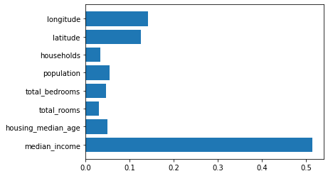
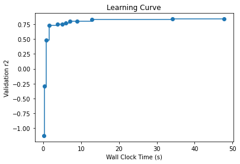

# AutoML for XGBoost

### Use built-in XGBoostSklearnEstimator

```python
from flaml import AutoML
from flaml.data import load_openml_dataset

# Download [houses dataset](https://www.openml.org/d/537) from OpenML. The task is to predict median price of the house in the region based on demographic composition and a state of housing market in the region.
X_train, X_test, y_train, y_test = load_openml_dataset(dataset_id=537, data_dir='./')

automl = AutoML()
settings = {
    "time_budget": 60,  # total running time in seconds
    "metric": 'r2',  # primary metrics for regression can be chosen from: ['mae','mse','r2']
    "estimator_list": ['xgboost'],  # list of ML learners; we tune XGBoost in this example
    "task": 'regression',  # task type  
    "log_file_name": 'houses_experiment.log',  # flaml log file
    "seed": 7654321,    # random seed
}
automl.fit(X_train=X_train, y_train=y_train, **settings)
```

#### Sample output

```
[flaml.automl: 09-29 23:06:46] {1446} INFO - Data split method: uniform
[flaml.automl: 09-29 23:06:46] {1450} INFO - Evaluation method: cv
[flaml.automl: 09-29 23:06:46] {1496} INFO - Minimizing error metric: 1-r2
[flaml.automl: 09-29 23:06:46] {1533} INFO - List of ML learners in AutoML Run: ['xgboost']
[flaml.automl: 09-29 23:06:46] {1763} INFO - iteration 0, current learner xgboost
[flaml.automl: 09-29 23:06:47] {1880} INFO - Estimated sufficient time budget=2621s. Estimated necessary time budget=3s.
[flaml.automl: 09-29 23:06:47] {1952} INFO -  at 0.3s,	estimator xgboost's best error=2.1267,	best estimator xgboost's best error=2.1267
[flaml.automl: 09-29 23:06:47] {1763} INFO - iteration 1, current learner xgboost
[flaml.automl: 09-29 23:06:47] {1952} INFO -  at 0.5s,	estimator xgboost's best error=2.1267,	best estimator xgboost's best error=2.1267
[flaml.automl: 09-29 23:06:47] {1763} INFO - iteration 2, current learner xgboost
[flaml.automl: 09-29 23:06:47] {1952} INFO -  at 0.6s,	estimator xgboost's best error=0.8485,	best estimator xgboost's best error=0.8485
[flaml.automl: 09-29 23:06:47] {1763} INFO - iteration 3, current learner xgboost
[flaml.automl: 09-29 23:06:47] {1952} INFO -  at 0.8s,	estimator xgboost's best error=0.3799,	best estimator xgboost's best error=0.3799
[flaml.automl: 09-29 23:06:47] {1763} INFO - iteration 4, current learner xgboost
[flaml.automl: 09-29 23:06:47] {1952} INFO -  at 1.0s,	estimator xgboost's best error=0.3799,	best estimator xgboost's best error=0.3799
[flaml.automl: 09-29 23:06:47] {1763} INFO - iteration 5, current learner xgboost
[flaml.automl: 09-29 23:06:47] {1952} INFO -  at 1.2s,	estimator xgboost's best error=0.3799,	best estimator xgboost's best error=0.3799
[flaml.automl: 09-29 23:06:47] {1763} INFO - iteration 6, current learner xgboost
[flaml.automl: 09-29 23:06:48] {1952} INFO -  at 1.5s,	estimator xgboost's best error=0.2992,	best estimator xgboost's best error=0.2992
[flaml.automl: 09-29 23:06:48] {1763} INFO - iteration 7, current learner xgboost
[flaml.automl: 09-29 23:06:48] {1952} INFO -  at 1.9s,	estimator xgboost's best error=0.2992,	best estimator xgboost's best error=0.2992
[flaml.automl: 09-29 23:06:48] {1763} INFO - iteration 8, current learner xgboost
[flaml.automl: 09-29 23:06:49] {1952} INFO -  at 2.2s,	estimator xgboost's best error=0.2992,	best estimator xgboost's best error=0.2992
[flaml.automl: 09-29 23:06:49] {1763} INFO - iteration 9, current learner xgboost
[flaml.automl: 09-29 23:06:49] {1952} INFO -  at 2.5s,	estimator xgboost's best error=0.2513,	best estimator xgboost's best error=0.2513
[flaml.automl: 09-29 23:06:49] {1763} INFO - iteration 10, current learner xgboost
[flaml.automl: 09-29 23:06:49] {1952} INFO -  at 2.8s,	estimator xgboost's best error=0.2513,	best estimator xgboost's best error=0.2513
[flaml.automl: 09-29 23:06:49] {1763} INFO - iteration 11, current learner xgboost
[flaml.automl: 09-29 23:06:49] {1952} INFO -  at 3.0s,	estimator xgboost's best error=0.2513,	best estimator xgboost's best error=0.2513
[flaml.automl: 09-29 23:06:49] {1763} INFO - iteration 12, current learner xgboost
[flaml.automl: 09-29 23:06:50] {1952} INFO -  at 3.3s,	estimator xgboost's best error=0.2113,	best estimator xgboost's best error=0.2113
[flaml.automl: 09-29 23:06:50] {1763} INFO - iteration 13, current learner xgboost
[flaml.automl: 09-29 23:06:50] {1952} INFO -  at 3.5s,	estimator xgboost's best error=0.2113,	best estimator xgboost's best error=0.2113
[flaml.automl: 09-29 23:06:50] {1763} INFO - iteration 14, current learner xgboost
[flaml.automl: 09-29 23:06:50] {1952} INFO -  at 4.0s,	estimator xgboost's best error=0.2090,	best estimator xgboost's best error=0.2090
[flaml.automl: 09-29 23:06:50] {1763} INFO - iteration 15, current learner xgboost
[flaml.automl: 09-29 23:06:51] {1952} INFO -  at 4.5s,	estimator xgboost's best error=0.2090,	best estimator xgboost's best error=0.2090
[flaml.automl: 09-29 23:06:51] {1763} INFO - iteration 16, current learner xgboost
[flaml.automl: 09-29 23:06:51] {1952} INFO -  at 5.2s,	estimator xgboost's best error=0.1919,	best estimator xgboost's best error=0.1919
[flaml.automl: 09-29 23:06:51] {1763} INFO - iteration 17, current learner xgboost
[flaml.automl: 09-29 23:06:52] {1952} INFO -  at 5.5s,	estimator xgboost's best error=0.1919,	best estimator xgboost's best error=0.1919
[flaml.automl: 09-29 23:06:52] {1763} INFO - iteration 18, current learner xgboost
[flaml.automl: 09-29 23:06:54] {1952} INFO -  at 8.0s,	estimator xgboost's best error=0.1797,	best estimator xgboost's best error=0.1797
[flaml.automl: 09-29 23:06:54] {1763} INFO - iteration 19, current learner xgboost
[flaml.automl: 09-29 23:06:55] {1952} INFO -  at 9.0s,	estimator xgboost's best error=0.1797,	best estimator xgboost's best error=0.1797
[flaml.automl: 09-29 23:06:55] {1763} INFO - iteration 20, current learner xgboost
[flaml.automl: 09-29 23:07:08] {1952} INFO -  at 21.8s,	estimator xgboost's best error=0.1797,	best estimator xgboost's best error=0.1797
[flaml.automl: 09-29 23:07:08] {1763} INFO - iteration 21, current learner xgboost
[flaml.automl: 09-29 23:07:11] {1952} INFO -  at 24.4s,	estimator xgboost's best error=0.1797,	best estimator xgboost's best error=0.1797
[flaml.automl: 09-29 23:07:11] {1763} INFO - iteration 22, current learner xgboost
[flaml.automl: 09-29 23:07:16] {1952} INFO -  at 30.0s,	estimator xgboost's best error=0.1782,	best estimator xgboost's best error=0.1782
[flaml.automl: 09-29 23:07:16] {1763} INFO - iteration 23, current learner xgboost
[flaml.automl: 09-29 23:07:20] {1952} INFO -  at 33.5s,	estimator xgboost's best error=0.1782,	best estimator xgboost's best error=0.1782
[flaml.automl: 09-29 23:07:20] {1763} INFO - iteration 24, current learner xgboost
[flaml.automl: 09-29 23:07:29] {1952} INFO -  at 42.3s,	estimator xgboost's best error=0.1782,	best estimator xgboost's best error=0.1782
[flaml.automl: 09-29 23:07:29] {1763} INFO - iteration 25, current learner xgboost
[flaml.automl: 09-29 23:07:30] {1952} INFO -  at 43.2s,	estimator xgboost's best error=0.1782,	best estimator xgboost's best error=0.1782
[flaml.automl: 09-29 23:07:30] {1763} INFO - iteration 26, current learner xgboost
[flaml.automl: 09-29 23:07:50] {1952} INFO -  at 63.4s,	estimator xgboost's best error=0.1663,	best estimator xgboost's best error=0.1663
[flaml.automl: 09-29 23:07:50] {2059} INFO - selected model: <xgboost.core.Booster object at 0x7f6399005910>
[flaml.automl: 09-29 23:07:55] {2122} INFO - retrain xgboost for 5.4s
[flaml.automl: 09-29 23:07:55] {2128} INFO - retrained model: <xgboost.core.Booster object at 0x7f6398fc0eb0>
[flaml.automl: 09-29 23:07:55] {1557} INFO - fit succeeded
[flaml.automl: 09-29 23:07:55] {1558} INFO - Time taken to find the best model: 63.427649974823
[flaml.automl: 09-29 23:07:55] {1569} WARNING - Time taken to find the best model is 106% of the provided time budget and not all estimators' hyperparameter search converged. Consider increasing the time budget.
```

#### Retrieve best config

```python
print('Best hyperparmeter config:', automl.best_config)
print('Best r2 on validation data: {0:.4g}'.format(1-automl.best_loss))
print('Training duration of best run: {0:.4g} s'.format(automl.best_config_train_time))
print(automl.model.estimator)
# Best hyperparmeter config: {'n_estimators': 473, 'max_leaves': 35, 'max_depth': 0, 'min_child_weight': 0.001, 'learning_rate': 0.26865031351923346, 'subsample': 0.9718245679598786, 'colsample_bylevel': 0.7421362469066445, 'colsample_bytree': 1.0, 'reg_alpha': 0.06824336834995245, 'reg_lambda': 250.9654222583276}
# Best r2 on validation data: 0.8384
# Training duration of best run: 2.194 s
# XGBRegressor(base_score=0.5, booster='gbtree',
#              colsample_bylevel=0.7421362469066445, colsample_bynode=1,
#              colsample_bytree=1.0, gamma=0, gpu_id=-1, grow_policy='lossguide',
#              importance_type='gain', interaction_constraints='',
#              learning_rate=0.26865031351923346, max_delta_step=0, max_depth=0,
#              max_leaves=35, min_child_weight=0.001, missing=nan,
#              monotone_constraints='()', n_estimators=473, n_jobs=-1,
#              num_parallel_tree=1, random_state=0, reg_alpha=0.06824336834995245,
#              reg_lambda=250.9654222583276, scale_pos_weight=1,
#              subsample=0.9718245679598786, tree_method='hist',
#              use_label_encoder=False, validate_parameters=1, verbosity=0)
```

#### Plot feature importance

```python
import matplotlib.pyplot as plt

plt.barh(X_train.columns, automl.model.estimator.feature_importances_)
```


#### Compute predictions of testing dataset

```python
y_pred = automl.predict(X_test)
print('Predicted labels', y_pred)
# Predicted labels [139062.95 237622.   140522.03 ... 182125.5  252156.36 264884.5 ]
```

#### Compute different metric values on testing dataset

```python
from flaml.ml import sklearn_metric_loss_score
print('r2', '=', 1 - sklearn_metric_loss_score('r2', y_pred, y_test))
print('mse', '=', sklearn_metric_loss_score('mse', y_pred, y_test))
print('mae', '=', sklearn_metric_loss_score('mae', y_pred, y_test))
# r2 = 0.8456494234135888
# mse = 2040284106.2781258
# mae = 30212.830996680445
```

#### Compare with untuned XGBoost

```python
from xgboost import XGBRegressor

xgb = XGBRegressor()
xgb.fit(X_train, y_train)
y_pred = xgb.predict(X_test)
from flaml.ml import sklearn_metric_loss_score
print('default xgboost r2', '=', 1 - sklearn_metric_loss_score('r2', y_pred, y_test))
# default xgboost r2 = 0.8265451174596482
```

#### Plot learning curve

How does the model accuracy improve as we search for different hyperparameter configurations?

```python
from flaml.data import get_output_from_log
import numpy as np

time_history, best_valid_loss_history, valid_loss_history, config_history, metric_history = \
    get_output_from_log(filename=settings['log_file_name'], time_budget=60)
plt.title('Learning Curve')
plt.xlabel('Wall Clock Time (s)')
plt.ylabel('Validation r2')
plt.step(time_history, 1 - np.array(best_valid_loss_history), where='post')
plt.show()
```


### Use a customized XGBoost learner

You can easily enable a custom objective function by adding a customized XGBoost learner (inherit XGBoostEstimator or XGBoostSklearnEstimator) in FLAML. In the following example, we show how to add such a customized XGBoost learner with a custom objective function.

```python
import numpy as np

# define your customized objective function
def logregobj(preds, dtrain):
    labels = dtrain.get_label()
    preds = 1.0 / (1.0 + np.exp(-preds)) # transform raw leaf weight
    grad = preds - labels
    hess = preds * (1.0 - preds)
    return grad, hess

from flaml.model import XGBoostEstimator

class MyXGB1(XGBoostEstimator):
    '''XGBoostEstimator with the logregobj function as the objective function
    '''

    def __init__(self, **config):
        super().__init__(objective=logregobj, **config)

class MyXGB2(XGBoostEstimator):
    '''XGBoostEstimator with 'reg:squarederror' as the objective function
    '''

    def __init__(self, **config):
        super().__init__(objective='reg:gamma', **config)
```

#### Add the customized learners and tune them

```python
automl = AutoML()
automl.add_learner(learner_name='my_xgb1', learner_class=MyXGB1)
automl.add_learner(learner_name='my_xgb2', learner_class=MyXGB2)
settings["estimator_list"] = ['my_xgb1', 'my_xgb2']  # change the estimator list
automl.fit(X_train=X_train, y_train=y_train, **settings)
```

[Link to notebook](https://github.com/microsoft/FLAML/blob/main/notebook/automl_xgboost.ipynb) | [Open in colab](https://colab.research.google.com/github/microsoft/FLAML/blob/main/notebook/automl_xgboost.ipynb)