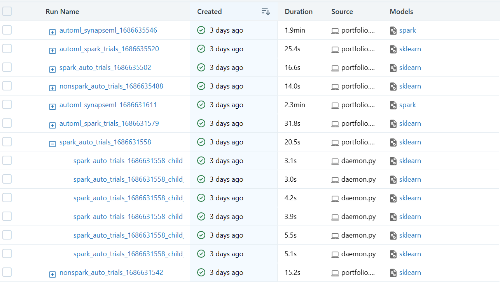
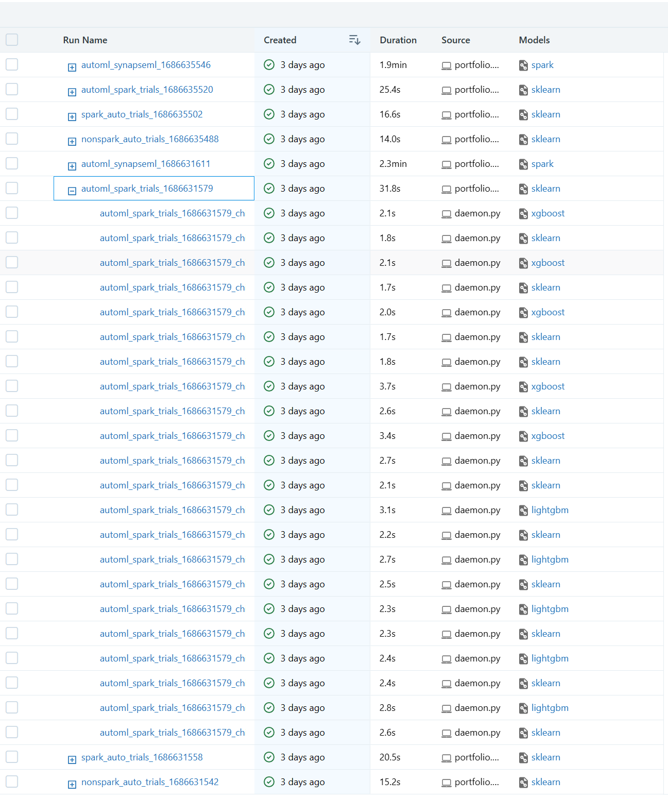
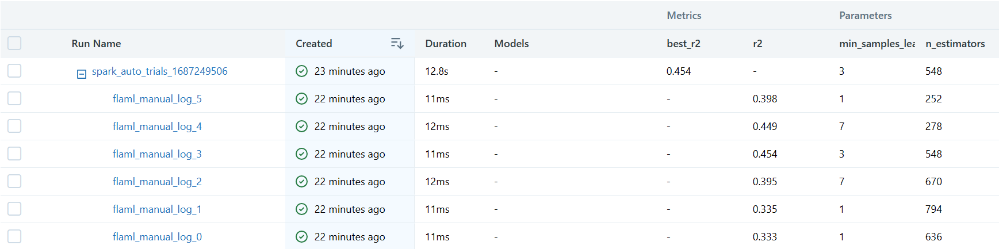
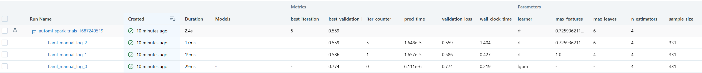
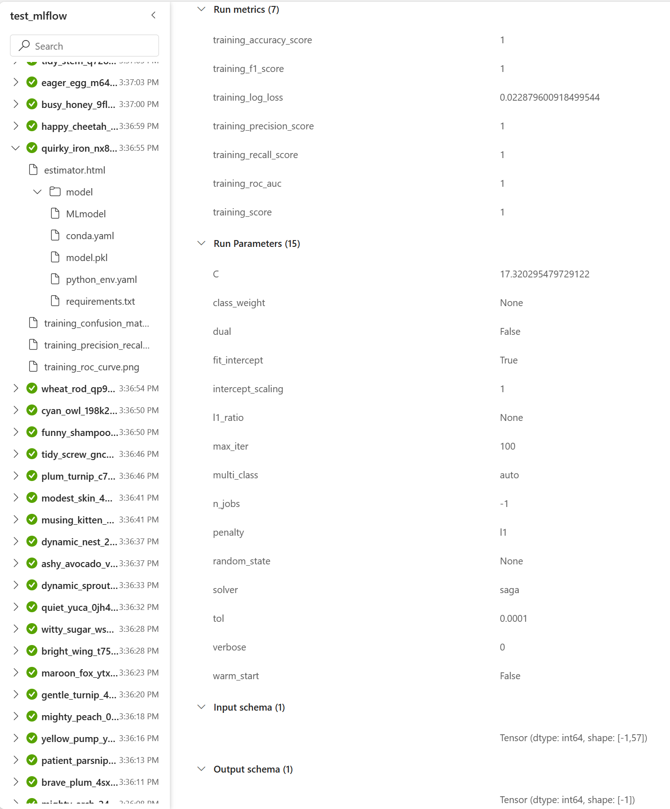
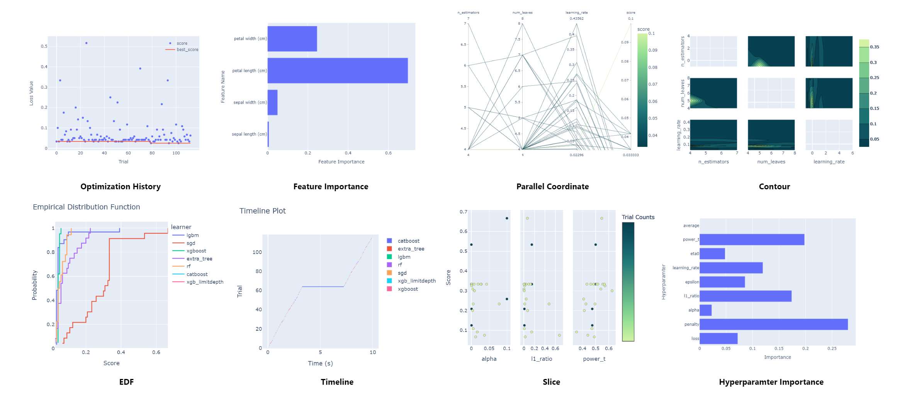

# AutoML and Hyperparameter Tuning with FLAML

This article demonstrates how to conduct AutoML and Hyperparameter Tuning experiments with FLAML using its API.

Here are the steps to set up an experiment using the API:

1. Prepare your data in the required format.
1. (For Hyperparameter Tuning) Define the tuning function.
1. Configure and start the experiment.
1. View the FLAML run on the MLFlow platform (Local/Microsoft Fabric).

## Prepare Data

For Hyperparameter Tuning, prepare your data according to the requirements of your tuning function. We will introduce the tuning function in the next section. In this section, we mainly focus on the data that AutoML requires.

The `flaml.AutoML` can process two main types of input data: **Pandas & Numpy Data** and **Spark Data**.

### Pandas & Numpy Data

For regular estimators like `lgbm, xgb, rf, ... `, AutoML can consume data in various formats by specifying arguments in `flaml.AutoML`.

1. **Split data and label**: You can prepare your data in a split form of data and label. Data of shape (n, m) should be a `numpy.array` or `pandas.Dataframe`, and labels of shape (n, ) should be `numpy.array` or `pandas.Series`. Later, when conducting experiments, pass your data using `X_train` and `y_train`.

   Here is an example code snippet for data in this format:

   ```python
   X_train = numpy.random(200, 30)  # 200 training instances of 30 dimensions
   y_train = numpy.randint(0, 10, size=200)
   ```

1. **Unified data and label**: Alternatively, you can provide your data and label together in a unified `pandas.Dataframe`. `label` is the name of your label column in your `dataframe`. When conducting experiments, pass your data using `dataframe` and `label`.

   An example code snippet of data in this format:

   ```python
   import pandas as pd
    # Creating a dictionary
    data = {"Square_Feet": [800, 1200, 1800, 1500, 850],
            "Age_Years": [20, 15, 10, 7, 25],
            "Price": [100000, 200000, 300000, 240000, 120000]}
    # Creating a pandas DataFrame
    dataframe = pd.DataFrame(data)
    label = "Price"
   ```

Further details about regular data can be found in the open-source FLAML [documentation](Use-Cases/Task-Oriented-AutoML#Overview).

### Spark Data

For Spark estimators, AutoML only consumes Spark data. FLAML provides a convenient function `to_pandas_on_spark` in the `flaml.automl.spark.utils` module to convert your data into a pandas-on-spark (`pyspark.pandas`) dataframe/series, which Spark estimators require.

This utility function takes data in the form of a `pandas.Dataframe` or `pyspark.sql.Dataframe` and converts it into a pandas-on-spark dataframe. It also takes `pandas.Series` or `pyspark.sql.Dataframe` and converts it into a [pandas-on-spark](https://spark.apache.org/docs/latest/api/python/user_guide/pandas_on_spark/index.html) series. If you pass in a `pyspark.pandas.Dataframe`, it will not make any changes.

This function also accepts optional arguments `index_col` and `default_index_type`.

- `index_col` is the column name to use as the index, default is None.
- `default_index_type` is the default index type, default is "distributed-sequence". More information about default index type could be found on Spark official [documentation](https://spark.apache.org/docs/latest/api/python/user_guide/pandas_on_spark/options.html#default-index-type)

Here is an example code snippet for Spark Data:

```python
import pandas as pd
from flaml.automl.spark.utils import to_pandas_on_spark

# Creating a dictionary
data = {
    "Square_Feet": [800, 1200, 1800, 1500, 850],
    "Age_Years": [20, 15, 10, 7, 25],
    "Price": [100000, 200000, 300000, 240000, 120000],
}

# Creating a pandas DataFrame
dataframe = pd.DataFrame(data)
label = "Price"

# Convert to pandas-on-spark dataframe
psdf = to_pandas_on_spark(dataframe)
```

To use Spark ML models you need to format your data appropriately. Specifically, use [`VectorAssembler`](https://spark.apache.org/docs/latest/api/python/reference/api/pyspark.ml.feature.VectorAssembler.html) to merge all feature columns into a single vector column.

Here is an example of how to use it:

```python
from pyspark.ml.feature import VectorAssembler

columns = psdf.columns
feature_cols = [col for col in columns if col != label]
featurizer = VectorAssembler(inputCols=feature_cols, outputCol="features")
psdf = featurizer.transform(psdf.to_spark(index_col="index"))["index", "features"]
```

Later in conducting the experiment, use your pandas-on-spark data like non-spark data and pass them using `X_train, y_train` or `dataframe, label`.

## Tuning Function

Same as in open-source FLAML, a tutorial can be found [here](https://microsoft.github.io/FLAML/docs/Use-Cases/Tune-User-Defined-Function).

## Configure Experiment

Detailed documentation about customizing experiments can be found here: [Hyperparameter Tuning](https://microsoft.github.io/FLAML/docs/Use-Cases/Tune-User-Defined-Function) & [AutoML](https://microsoft.github.io/FLAML/docs/Use-Cases/Task-Oriented-AutoML/).

You can activate Spark as the parallel backend during parallel tuning in both [AutoML](../Use-Cases/Task-Oriented-AutoML#parallel-tuning) and [Hyperparameter Tuning](../Use-Cases/Tune-User-Defined-Function#parallel-tuning), by setting the `use_spark` to `true`. FLAML will dispatch your job to the distributed Spark backend using [`joblib-spark`](https://github.com/joblib/joblib-spark).

Please note that you should not set `use_spark` to `true` when applying AutoML and Tuning for Spark Data. This is because only SparkML models will be used for Spark Data in AutoML and Tuning. As SparkML models run in parallel, there is no need to distribute them with `use_spark` again.

All the Spark-related arguments are stated below. These arguments are available in both Hyperparameter Tuning and AutoML:

- `use_spark`: boolean, default=False | Whether to use spark to run the training in parallel spark jobs. This can be used to accelerate training on large models and large datasets, but will incur more overhead in time and thus slow down training in some cases. GPU training is not supported yet when use_spark is True. For Spark clusters, by default, we will launch one trial per executor. However, sometimes we want to launch more trials than the number of executors (e.g., local mode). In this case, we can set the environment variable `FLAML_MAX_CONCURRENT` to override the detected `num_executors`. The final number of concurrent trials will be the minimum of `n_concurrent_trials` and `num_executors`.
- `n_concurrent_trials`: int, default=1 | The number of concurrent trials. When n_concurrent_trials > 1, FLAML performes parallel tuning.
- `force_cancel`: boolean, default=False | Whether to forcely cancel Spark jobs if the search time exceeded the time budget. Spark jobs include parallel tuning jobs and Spark-based model training jobs.

Below are some additional commonly used parameters for AutoML:

- `estimator_list`: A list of strings for estimator names, or 'auto'. e.g., `['lgbm', 'xgboost', 'xgb_limitdepth', 'catboost', 'rf', 'extra_tree']`.
- `time_budget`: A float number of the time budget in seconds. Use -1 if no time limit.
- `max_iter`: An integer of the maximal number of iterations. NOTE: when both time_budget and max_iter are unspecified, only one model will be trained per estimator.
- `log_type`: A string of the log type, one of ['better', 'all']. Default is 'better', only logs configs with better loss than previous iters; 'all' logs all the tried configs.

An example code snippet for using parallel Spark jobs:

```python
import flaml

automl_experiment = flaml.AutoML()
automl_settings = {
    "time_budget": 30,
    "metric": "r2",
    "task": "regression",
    "n_concurrent_trials": 2,
    "use_spark": True,
    "force_cancel": True,  # Activating the force_cancel option can immediately halt Spark jobs once they exceed the allocated time_budget.
    "log_type": "all",  # flaml only logs better configs than the previous iters by default, set to "all" to log all trials
}

automl.fit(
    dataframe=dataframe,
    label=label,
    **automl_settings,
)
```

[Link to notebook](https://github.com/microsoft/FLAML/blob/main/notebook/integrate_spark.ipynb)

### Feature List

- Extra models supported for AutoML.

### SparkML Models

#### Model List

Note: Estimator name in **`bold`** is activated by default.

- **`lgbm_spark`**: The class for fine-tuning Spark version LightGBM models, using [SynapseML](https://microsoft.github.io/SynapseML/docs/features/lightgbm/about/) API. This model is also available in open-source FLAML.
- **`rf_spark`**: Random Forest [Classifier](https://spark.apache.org/docs/latest/api/python/reference/api/pyspark.ml.classification.RandomForestClassifier.html#pyspark.ml.classification.RandomForestClassifier) and [Regressor](https://spark.apache.org/docs/latest/api/python/reference/api/pyspark.ml.regression.RandomForestRegressor.html#pyspark.ml.regression.RandomForestRegressor) APIs in `pyspark.ml`.
- `gbt_spark`: Gradient-Boosted Trees (GBT) [Classifier](https://spark.apache.org/docs/latest/api/python/reference/api/pyspark.ml.classification.GBTClassifier.html) and [Regressor](https://spark.apache.org/docs/latest/api/python/reference/api/pyspark.ml.regression.GBTRegressor.html) APIs in `pyspark.ml`. Note that employ GBTClassifier only support binary classification task.
- `nb_spark`: [Naive Bayes Classifier](https://spark.apache.org/docs/latest/api/python/reference/api/pyspark.ml.classification.NaiveBayes.html) for classification task only.
- `glr_spark`: [Generalized Linear Regression ](https://spark.apache.org/docs/latest/api/python/reference/api/pyspark.ml.regression.GeneralizedLinearRegression.html) for regression task only.
- `lr_spark`: [Linear Regression](https://spark.apache.org/docs/latest/api/python/reference/api/pyspark.ml.regression.LinearRegression.html) for regression task only.
- `svc_spark`: [Linear SVC](https://spark.apache.org/docs/latest/api/python/reference/api/pyspark.ml.classification.LinearSVC.html) for binary classification task only.
- `aft_spark`: [Accelerated Failure Time (AFT) Model Survival Regression](https://spark.apache.org/docs/latest/api/python/reference/api/pyspark.ml.regression.AFTSurvivalRegression.html). This estimator only support survival analysis task, which is a regression task that requires an extra `censorCol` argument.

#### Usage

First, prepare your data in the required format as described in the previous section.

By including the models you intend to try in the `estimators_list` argument to `flaml.automl`, FLAML will start trying configurations for these models. If your input is Spark data, FLAML will also use estimators with the `_spark` postfix by default, even if you haven't specified them.

Here is an example code snippet using SparkML models in AutoML:

```python
import flaml

# prepare your data in pandas-on-spark format as we previously mentioned

automl = flaml.AutoML()
settings = {
    "time_budget": 30,
    "metric": "r2",
    "estimator_list": ["lgbm_spark", "rf_spark"],  # this setting is optional
    "task": "regression",
}

automl.fit(
    dataframe=psdf,
    label=label,
    **settings,
)
```

[Link to notebook](https://github.com/microsoft/FLAML/blob/main/notebook/automl_bankrupt_synapseml.ipynb)

### Non-spark Models

#### Model List

Note: Estimator name in **`bold`** is activated by default.

- **`sgd`**: Stoachastic Gradient Descent [Classifier](https://scikit-learn.org/stable/modules/generated/sklearn.linear_model.SGDClassifier.html) and [Regressor](https://scikit-learn.org/stable/modules/generated/sklearn.linear_model.SGDRegressor.html) for both classification and regression task.
- `svc`: [Linear Support Vector Classifier](https://scikit-learn.org/stable/modules/generated/sklearn.svm.LinearSVC.html) for classification task only.
- `enet`: [Elastic Net](https://scikit-learn.org/stable/modules/generated/sklearn.linear_model.ElasticNet.html) for regression task only.
- `lassolars`: [Lasso model fit with Least Angle Regression](https://scikit-learn.org/stable/modules/generated/sklearn.linear_model.LassoLars.html) for regression task and time-series forecast task.
- `tcn`: [Temporal Convolutional Networks](https://github.com/locuslab/TCN/) for time-series forecast task. This model is implemented in PyTorch and could use GPUs to acclerate.
- `snaive, naive, savg, avg`: Four simple models SeasonalNaive, Naive, SeasonalAverage, Average for time-series forecast task. Details about algorithm behind these models could be found [here](https://otexts.com/fpp2/simple-methods.html).

#### Usage

These models consume regular data like Pandas Dataframe, and usage is like all other estimators in [AutoML](Use-Cases/Task-Oriented-AutoML#estimator-and-search-space)

## MLFlow Integration

Our internal MLFlow integration enhances FLAML's ability to effectively log your experiments using `flaml.tune` or `flaml.automl`.

### Main Features

- Logging of distributed experiments on Spark.
- Organization of your experiment trials into nested runs and renaming of child runs.

### Quick Start

```python
import mlflow
```

First, you need to enable MLFlow autologging. We support both MLFlow autologging and manual logging. If your machine learning tools are not yet supported by `mlflow.autolog`, or if you have specific requirements, you can skip this step.

```python
mlflow.autolog()
```

Next, you can manually start the parent run outside of `flaml.tune` or `flaml.automl`.

Once you manually start a parent run, the MLFlow integration feature will be enabled, regardless of whether auto logging or manual logging is used.

Spark support will be automatically enabled once you set `use_spark=True`.

- You can specify the `run_name` argument for `mlflow.start_run()`. Child runs will be renamed according to the parent run's name.
- You can specify `mlflow_exp_name` in `flaml.tune` or `flaml.automl`. If you leave it blank, FLAML will detect the current experiment for you.

Retrain process will be disabled if you switch on `mlflow.autolog` but not start parent run. If you start parent run, retrain process will be utilized to log best run information to your parent run. If not retrained, FLAML will copy run information from best child run to parent run.

FLAML will log run tags to mlflow runs:

- `synapseml.flaml.best_run`: A bool flag to identify best run in current experiment.
- `synapseml.flaml.run_source`: The type of current experiment. The value could be:
  - `flaml-automl` for AutoML experiment.
  - `flaml-tune` for Hyperparameter Tuning experiment.
- `synapseml.flaml.version`: Current version of FLAML.
- `synapseml.flaml.metric`: The metric name used in current experiment. For example `"r2"`.
- `synapseml.flaml.iteration_number`: The index of current run in the experiment.

For AutoML experiment, extra tags will be logged:

- `synapseml.flaml.estimator_name`: Name of the estimator used in current run. For example `"lgbm"`.
- `synapseml.flaml.estimator_class`: Class name of the estimator. For example `LGBMEstimator`.
- `synapseml.flaml.learner`: Name of the learner used in current run. Value is same as `synapseml.flaml.estimator_name` for now.
- `synapseml.flaml.sample_size`: The sample size of dataset in current run.

```python
import flaml

# for flaml.tune
with mlflow.start_run(run_name=f"spark_auto_trials_1686631558"):
    analysis = flaml.tune.run(
        func_to_tune,
        params,
        metric="r2",
        mode="max",
        mlflow_exp_name="test_doc",
        use_spark=True,
    )

# for flaml.automl
automl_experiment = flaml.AutoML()
automl_settings = {
    "metric": "r2",
    "task": "regression",
    "use_spark": True,
    "mlflow_exp_name": "test_doc",
    "estimator_list": [
        "lgbm",
        "rf",
        "xgboost",
        "extra_tree",
        "xgb_limitdepth",
    ],  # catboost does not yet support mlflow autologging
}
with mlflow.start_run(run_name=f"automl_spark_trials_1686631579"):
    automl_experiment.fit(X_train=train_x, y_train=train_y, **automl_settings)
```

### Results

*Tune Autolog Trials on MLFlow UI*



*AutoML Autolog Trials on MLFlow UI*



### Differences Between Auto and Manual Logging

Autologging is managed by MLFlow, while manual logging is maintained by FLAML.

#### Details of Manual Logging

FLAML logs general artifacts for AutoML tasks. Specifically, we log these artifacts:

**`flaml.tune`**



- We create a parent run to log the best metric and the best configuration for the entire tuning process.
- For each trial, we create a child run to log the metric specific to the tune function and the configuration for that trial.

**`flaml.automl`**



- We create a parent run to log the results of the experiment. This includes:
  - The configuration of this model.
  - The `best_validation_loss` produced by this model.
  - The `best_iteration` to identify the point at which this model was found.
- For each state (a specific learner with different hyperparameters), we record the best trial for this model. This includes:
  - The configuration of the best trial.
  - The `validation_loss` the best trial produces.
  - The `iter_count` to identify how many trials we have conducted for this state.
  - The `pred_time`, which is the time cost of predicting test data for this model.
  - The `wall_clock_time`, which is the time cost of this state.
  - The `sample_size` to show how much data we sampled in this state.
    Note that we also added these information to autolog AutoML run.

#### Details of Autologging

Autolog artifacts typically include model parameters, model files, and runtime metrics like the following:



Artifacts can differ among various machine learning libraries. More detailed information can be found [here](https://mlflow.org/docs/latest/tracking.html#automatic-logging).

## Plot Experiment Result

The `flaml.visualization` module provides utility functions for plotting the optimization process using [plotly](https://plotly.com/python/). Leveraging `plotly`, users can interactively explore experiment results. To use these plotting functions, simply provide your optimized `flaml.AutoML` or `flaml.tune.tune.ExperimentAnalysis` object as input. Optional parameters can be added using keyword arguments.

Avaliable plotting functions:

- `plot_optimization_history`: Plot optimization history of all trials in the experiment.
- `plot_feature_importance`: Plot importance for each feature in the dataset.
- `plot_parallel_coordinate`: Plot the high-dimensional parameter relationships in the experiment.
- `plot_contour`: Plot the parameter relationship as contour plot in the experiment.
- `plot_edf`: Plot the objective value EDF (empirical distribution function) of the experiment.
- `plot_timeline`: Plot the timeline of the experiment.
- `plot_slice`: Plot the parameter relationship as slice plot in a study.

### Figure Examples



Check out our example [notebook](../../notebook/trident/automl_plot.ipynb) for a preview of all interactive plots.
