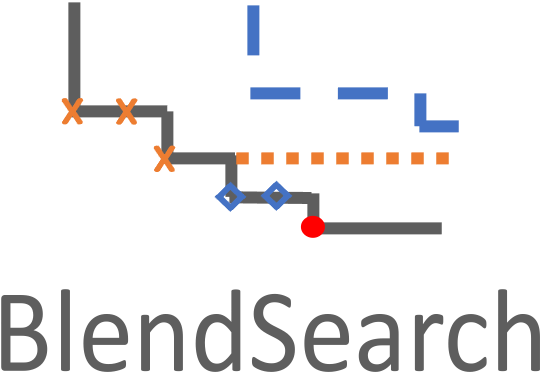

# Tune User-defined Function

`flaml.tune` is a module for economical hyperparameter tuning. It is used internally by `flaml.AutoML`. It can be used directly to tune a user-defined function (UDF), and not limited to machine learning model training. You can use `flaml.tune` instead of `flaml.AutoML` if one of the following is true:

1. Your machine learning task is not one of the built-in tasks from `flaml.AutoML`.
1. Your input cannot be represented as X_train + y_train or dataframe + label.
1. You want to tune a function that may not even be a machine learning procedure.

## Key concepts in the usage of `flaml.tune`
The usage of `flaml.tune` is, to a large extent, similar to the usage of `ray.tune`.  Interested users can find a more extensive documentation about `ray.tune` [here](https://docs.ray.io/en/latest/tune/key-concepts.html). 

### **Search space**
In tuning your hyperparameters, you need to define a search space. In the search space, you need to specify valid values for your hyperparameters and can specify how these values are sampled (e.g. from a uniform distribution or a normal distribution). 

In the following code example, we include a search space with includes two hyperparameters named `x` and `y`, the valid values for both are all integer in the range of [1,10000]. The values for `x` are sampled uniformly in the specified range (using `tune.randit(lower=1, upper=100000)`), and the values for `y` are sampled in log space within the specified range (using `tune.lograndit(lower=1, upper=100000)`).

```python
from flaml import tune
config={
        'x': tune.lograndint(lower=1, upper=100000),
        'y': tune.randint(lower=1, upper=100000)
    }, # the search space
```

### **Objective fucntion**

To use `tune` , you will need to wrap your objective function in a lightweight trainable API. Attached below is an exmaple of how to write your objective into a function-based trainable API. In the following code, we define an objective function regarding the hyperparameters `x` and `y` introduced: $obj := (x-85000)^2 - x/y$. 


```python
import time

def evaluate_config(config):
    '''evaluate a hyperparameter configuration'''
    # we uss a toy example with 2 hyperparameters
    # metric is the target minimization/maximization objective
    metric = (config['x']-85000)**2 - config['x']/config['y']
    # usually the evaluation takes an non-neglible cost
    # and the cost could be related to certain hyperparameters
    # here we simulate this cost by call the time.sleep() function
    # in this example, we assume the cost it's proportional to x
    time.sleep(config['x']/100000)
    # use tune.report to report the metric to optimize  
    tune.report(metric=metric)
```

### **Hyperparameter optimization/search algorithm**
To tune the hyperparameters toward your objective, you will want to use a hyperparameter optimization or search algorithm which can help suggest hyperparameters with better performance (regarding your objective). `flaml` offers two HPO methods: CFO and BlendSearch. `flaml.tune` uses BlendSearch by default.


## Sequential and parallel tuning using `flaml.tune` 

### Sequential tuning
Recommended when compute resource is limited and each trial can consume all the resources.

In the following code, we show how to use `flaml.tune` to do hyperparamter search with the pre-defined search space `config` and objective function `evaluate_config` using the default serach algorithm in flaml.

```python
# require: pip install flaml[blendsearch]
analysis = tune.run(
    evaluate_config,    # the function to evaluate a config
    config={
        'x': tune.lograndint(lower=1, upper=100000),
        'y': tune.randint(lower=1, upper=100000)
    }, # the search space
    low_cost_partial_config={'x':1},    # a initial (partial) config with low cost
    metric='metric',    # the name of the metric used for optimization
    mode='min',         # the optimization mode, 'min' or 'max'
    num_samples=-1,    # the maximal number of configs to try, -1 means infinite
    time_budget_s=60,   # the time budget in seconds
    local_dir='logs/',  # the local directory to store logs
    # verbose=0,          # verbosity  
    # use_ray=True, # uncomment when performing parallel tuning using ray
    )

print(analysis.best_trial.last_result)  # the best trial's result
print(analysis.best_config) # the best config
```
### Parallel tuning

## Hyperparameter optimization algorithm choice in `flaml.tune`

`flaml` offers two HPO methods: CFO and BlendSearch.
`flaml.tune` uses BlendSearch by default.

<!--  | 
:---:|:---: -->


### **CFO: Frugal Optimization for Cost-related Hyperparameters**

CFO uses the randomized direct search method FLOW<sup>2</sup> with adaptive stepsize and random restart.
It requires a low-cost initial point as input if such point exists.
The search begins with the low-cost initial point and gradually move to
high cost region if needed. The local search method has a provable convergence
rate and bounded cost.

About FLOW<sup>2</sup>: FLOW<sup>2</sup> is a simple yet effective randomized direct search method.
It is an iterative optimization method that can optimize for black-box functions.
FLOW<sup>2</sup> only requires pairwise comparisons between function values to perform iterative update. Comparing to existing HPO methods, FLOW<sup>2</sup> has the following appealing properties:

1. It is applicable to general black-box functions with a good convergence rate in terms of loss.
1. It provides theoretical guarantees on the total evaluation cost incurred.

The GIFs attached below demonstrate an example search trajectory of FLOW<sup>2</sup> shown in the loss and evaluation cost (i.e., the training time ) space respectively. FLOW<sup>2</sup> is used in tuning the # of leaves and the # of trees for XGBoost. The two background heatmaps show the loss and cost distribution of all configurations. The black dots are the points evaluated in FLOW<sup>2</sup>. Black dots connected by lines are points that yield better loss performance when evaluated.

 | 
:---:|:---:

From the demonstration, we can see that (1) FLOW<sup>2</sup> can quickly move toward the low-loss region, showing good convergence property and (2) FLOW<sup>2</sup> tends to avoid exploring the high-cost region until necessary.

Example:

```python
from flaml import CFO
tune.run(...
    search_alg = CFO(low_cost_partial_config=low_cost_partial_config),
)
```

Recommended scenario: there exist cost-related hyperparameters and a low-cost
initial point is known before optimization.
If the search space is complex and CFO gets trapped into local optima, consider
using BlendSearch.

### **BlendSearch: Economical Hyperparameter Optimization With Blended Search Strategy**


BlendSearch combines local search with global search. It leverages the frugality
of CFO and the space exploration ability of global search methods such as
Bayesian optimization. Like CFO, BlendSearch requires a low-cost initial point
as input if such point exists, and starts the search from there. Different from
CFO, BlendSearch will not wait for the local search to fully converge before
trying new start points. The new start points are suggested by the global search
method and filtered based on their distance to the existing points in the
cost-related dimensions. BlendSearch still gradually increases the trial cost.
It prioritizes among the global search thread and multiple local search threads
based on optimism in face of uncertainty.

Example:

```python
# require: pip install flaml[blendsearch]
from flaml import BlendSearch
tune.run(...
    search_alg = BlendSearch(low_cost_partial_config=low_cost_partial_config),
)
```

* Recommended scenario: cost-related hyperparameters exist, a low-cost
initial point is known, and the search space is complex such that local search
is prone to be stuck at local optima.

* Suggestion about using larger search space in BlendSearch:
In hyperparameter optimization, a larger search space is desirable because it is more likely to include the optimal configuration (or one of the optimal configurations) in hindsight. However the performance (especially anytime performance) of most existing HPO methods is undesirable if the cost of the configurations in the search space has a large variation. Thus hand-crafted small search spaces (with relatively homogeneous cost) are often used in practice for these methods, which is subject to idiosyncrasy. BlendSearch combines the benefits of local search and global search, which enables a smart (economical) way of deciding where to explore in the search space even though it is larger than necessary. This allows users to specify a larger search space in BlendSearch, which is often easier and a better practice than narrowing down the search space by hand.

For more technical details, please check our papers.

* [Frugal Optimization for Cost-related Hyperparameters](https://arxiv.org/abs/2005.01571). Qingyun Wu, Chi Wang, Silu Huang. AAAI 2021.

```bibtex
@inproceedings{wu2021cfo,
    title={Frugal Optimization for Cost-related Hyperparameters},
    author={Qingyun Wu and Chi Wang and Silu Huang},
    year={2021},
    booktitle={AAAI'21},
}
```

* [Economical Hyperparameter Optimization With Blended Search Strategy](https://www.microsoft.com/en-us/research/publication/economical-hyperparameter-optimization-with-blended-search-strategy/). Chi Wang, Qingyun Wu, Silu Huang, Amin Saied. ICLR 2021.

```bibtex
@inproceedings{wang2021blendsearch,
    title={Economical Hyperparameter Optimization With Blended Search Strategy},
    author={Chi Wang and Qingyun Wu and Silu Huang and Amin Saied},
    year={2021},
    booktitle={ICLR'21},
}
```
